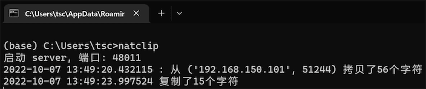
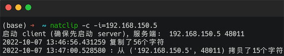

实现windows、macos或及其之间的剪切板文本共享, 可用于moonlight串流等远程控制剪切板不能用或失效的问题.

# 教程

1. 安装 python 3 和 pip (自行解决)

2. 打开终端运行(两台电脑都需要): pip install natclip

3. 启动服务端: python -c "import natclip as n; n.server()"

4. 启动客户端: python -c "import natclip as n; n.client('这里填服务端的ip地址')"

5. 服务端防火墙放行tcp端口(默认端口48011)

6. 通过服务端再启动客户端连接另一个服务端可以实现多台电脑的共享剪切板

7. 套一个加密代理和内网穿透可以实现公网剪切板共享

## windows server 端的一个例子

## macos client 端的一个例子

